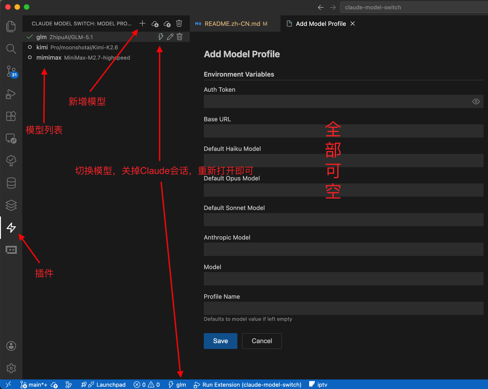

# Claude Model Switch

[中文文档](README.md)

A VSCode extension for managing Claude Code model settings per project.

If you use Claude Code for VS Code in multiple projects at the same time and need different model settings for different projects, one project might use Claude while another uses GLM, Kimi, Qwen, or MiniMax through a compatible API.

This extension can save those settings and switch between models. It updates the project's `.claude/settings.local.json`, so each project can keep its own model, base URL, and token configuration.

## Preview



## Features

- **Model Profile Management**: Add, edit, and delete model profiles
- **Per-Project Switching**: Each project can use a different model — switch instantly without affecting others
- **Status Bar**: Shows the current active model in the bottom status bar
- **Tree View Sidebar**: Lists all profiles with inline action buttons (switch, edit, delete)
- **Export/Import**: Export profiles to JSON for backup or sharing; import with conflict resolution
- **Model list and speed test**: Fetch model lists from the base URL, pick models from dropdowns, and speed-test individual model fields or saved profiles
- **Auto-fill**: Profile name defaults to model value; empty fields remove the corresponding managed settings

## Usage

### Switch Model

- Click the model name in the **status bar** (bottom left)
- Or use the ⚡ (zap) inline button on any profile in the sidebar tree view
- Or run `Claude: Switch to Model Profile` from the command palette

### Add Profile

- Click the ➕ button at the top of the sidebar tree view
- Or run `Claude: Add Model Profile` from the command palette
- Fill in the fields in the webview panel (all optional)
- After entering a base URL, click **Fetch Models** to load available models into the dropdowns next to each model field (base URL is required)
- Each model field has a **Speed Test** button, so you can test the current model, base URL, and token combination before saving the profile

### Edit / Delete Profile

- Use the inline ✏️ / 🗑️ buttons on each profile row in the sidebar
- Or right-click a profile row for context menu options

### Export / Import

- Use the sidebar header buttons or command palette:
  - `Claude: Export Model Profiles` — saves all profiles to a JSON file
  - `Claude: Import Model Profiles` — loads profiles from a JSON file, prompts for conflict resolution

## Development

### Prerequisites

- Node.js 20+
- pnpm
- VSCode 1.85+

### Setup

```bash
git clone <repo-url>
cd claude-model-switch
pnpm install
```

### Build

```bash
pnpm run build
```

### Watch (for development)

```bash
pnpm run watch
```

### Debug in VSCode

1. Open this project in VSCode
2. Press `F5` or use the **Run Extension** launch configuration
3. This opens a new VSCode Extension Development Host window with the extension loaded
4. Make changes in `src/`, the watch task auto-rebuilds
5. Reload the Extension Development Host window (`Ctrl+R` / `Cmd+R`) to see changes

### Type Check

```bash
pnpm run lint
```

### Available Scripts

- `pnpm run build` — build the extension once into `out/extension.js`
- `pnpm run build:prod` — build the production bundle used for packaging and publishing
- `pnpm run watch` — rebuild automatically while developing
- `pnpm run lint` — run TypeScript type checking
- `pnpm run package:vsix` — package the extension as `dist/claude-model-switch.vsix` for local installation or manual distribution
- `pnpm run release:patch` — bump patch version and publish to VSCode Marketplace
- `pnpm run release:minor` — bump minor version and publish to VSCode Marketplace
- `pnpm run release:major` — bump major version and publish to VSCode Marketplace

## Publishing

Required secrets:

- `VSCE_PAT` — required for publishing to VSCode Marketplace
- `OVSX_PAT` — optional, used for publishing to Open VSX

### Local packaging only

Use this when you only want a `.vsix` file for testing or for sending to someone else directly.

```bash
pnpm run package:vsix
```

This produces `dist/claude-model-switch.vsix`, which can be installed manually:

```bash
code --install-extension dist/claude-model-switch.vsix
```

### Local Marketplace publishing

Use this when you want to publish from your own machine and let `vsce` automatically bump the version in `package.json`.

```bash
pnpm run release:patch
```

You can replace `patch` with `minor` or `major`.

### GitHub Actions: tag-based publish

Use this when the version is already decided and committed locally.

```bash
git tag v0.0.1
git push origin v0.0.1
```

This workflow will:

1. install dependencies with pnpm
2. build the extension
3. package `dist/claude-model-switch.vsix`
4. publish that exact package to VSCode Marketplace
5. optionally publish the same package to Open VSX

### GitHub Actions: manual release with automatic version bump

Use the `Manual Marketplace Release` workflow in GitHub Actions when you want GitHub to perform the version bump and publish for you.

Workflow input:

- `patch` — bugfix release, e.g. `0.0.1 -> 0.0.2`
- `minor` — backward-compatible feature release, e.g. `0.0.1 -> 0.1.0`
- `major` — breaking release, e.g. `0.0.1 -> 1.0.0`

This workflow will:

1. run `vsce publish patch|minor|major`
2. update `package.json`
3. create the version tag
4. push the commit and tags back to GitHub

## How It Works

- **Profiles** are stored in VSCode's `globalState` (persists across sessions, machine-specific)
- **Active profile ID** is recorded in `<workspace>/.claude/.claude-model-switch-active.json`
- **Switching** manages only the `model` field and supported `env` fields in `<workspace>/.claude/settings.local.json`; managed fields left empty in a profile are removed from `settings.local.json`, while other settings are preserved
- If the active profile ID is not found, it falls back to full-field matching against the current `settings.local.json`
- Status bar and tree view auto-refresh when switching editors or when `settings.local.json` changes
